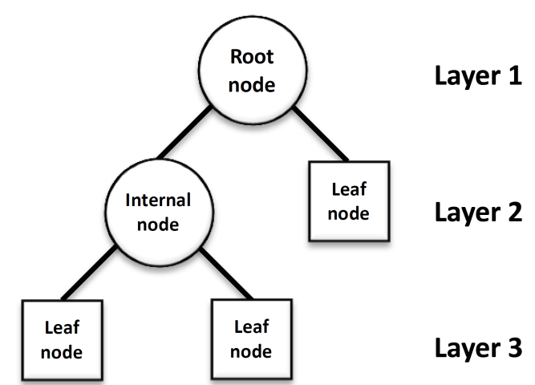
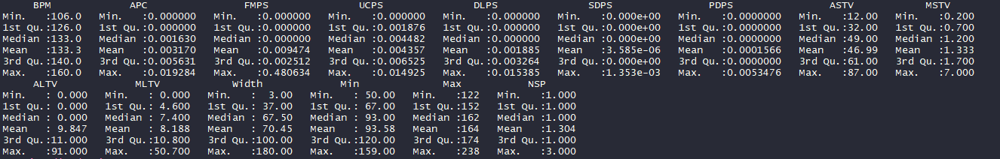
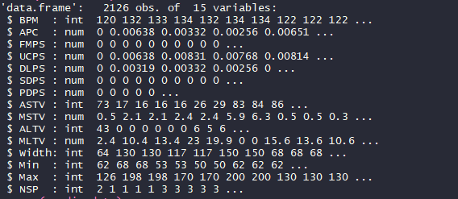
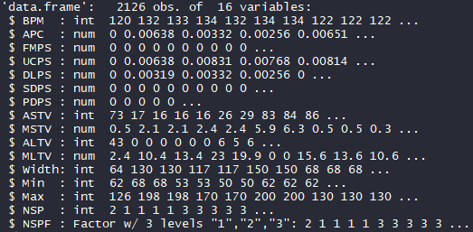
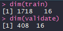
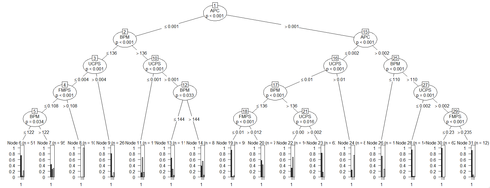
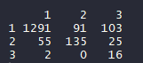
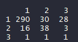

# Decision Tree on a Medical dataset

The project consists of implementing decision tress for classification and regression on a medical dataset

# Getting Started

- Download [https://code.visualstudio.com/] or another alternative source-code editor of your preference
- Download the project on [https://github.com/taxenco/Decision_Tree_R].
- Go to your terminal and run the following command --> git clone https://github.com/taxenco/Decision_Tree_R.
- Access to Visual Studio Code or another alternative source-code editor and open the project. Alternatively, you can access the project on through the terminal.
- Download R support for Visual Studio Code

# Prerequisites

- Visual Studio Code or another alternative source-code editor.
- Linux.
- R support for Visual Studio Code.
- Package ‘party’ [3]
- Able to read CSV files.

# Objective of the project

This project will implement a classification Decision Tree algorithm on a Fetal cardiology medical dataset. It will classify the Fetal case (NSP) and predict to which of the following categories will the fetal case belong to:

N=normal (1);

S=Suspect (2);

P=Pathologic (3)

Important: this project will use a black-box approach making use of other’s packages to analyse the information. The black-box approach has been chosen for its simplicity but needs to be noted that this approach entails a great peril of not understanding what happens within the function and end up with wrong results.

# Theory on Decision Trees

A decision tree is a decision[1] support tool that uses a tree-like model of decisions and their possible consequences, including chance event outcomes, resource costs, and utility. It is one way to display an algorithm that only contains conditional control statements.  

A decision tree is a predictive model which can be used to model both classification and regression problems, in operations research decision trees refer to a hierarchical model of decisions and their consequences [2].

The decision-maker employs decision trees to identify the strategy which will most likely reach its goal. When we use a decision tree for classification tasks, it is most commonly referred to as a classification tree.
 

A decision tree consists of three types of nodes[1]: 

Decision nodes – typically represented by squares
Chance nodes – typically represented by circles
End nodes – typically represented by triangles

 # Data

The data selected is a Fetal cardiology dataset found on:

https://archive.ics.uci.edu/ml/datasets/cardiotocography

The dataset is made 14 decision variables and 1 class variable.

·         BPM (Beat per minutes)

·         APC (Accelerations per second)

·         FMPS (Fetal movement per second)

·         UCPS (Uterine contractions per second)

·         DLPS (Light declaration per second)

·         SDPS (Severe declaration per second)

·         PDPS (Prolonged declaration per second)

·         ASTV (% of abnormal short term Variability)

·         MSTV (Mean of short term Variability)

·         ALTV (% of abnormal long term Variability)

·         MLTV (Mean of long term Variability)

·         Width (Width of FHR Histogram)

·         Min (Min Width of FHR Histogram)

·         Max (Max Width of FHR Histogram)

·         NSP (Fetal State Class codeN=normal (1); S=Suspect (2); P=Pathologic (3))

# Data cleaning

The dataset is already cleaned and it is ready for performing the decision tree.

Performing classification Decision Tree

this section will show how to perform a classification decision tree on the medical dataset

Let’s start by exploring the data by calculating the 5 numbers summary of each variable.

As we can see the data is cleaned and there are not extreme values.

Now, let’s explore the date frame.

We can see that the NPS which is a class variable is an INT, however It needs to be a converted into categorical variable to predict.

In order to perform the decision trees we will need to split the dataset in 2. The training dataset and the test dataset for validation. In this instance, the weight of the training is 80% and the validation is 20%.

Now we can start training the model.

Confusion matrix[4] of the model training data.

Calculate classification accuracy = 0.8393481

classification error =  0.1606519

Confusion matrix of the model trained model with test data set

Calculate classification accuracy = 0.8063725

classification error =  0.1936275

# Conclusion

A decision tree is an excellent tool for classification problems and for its simplicity that allows the user to interpret the information very quickly. However, the decision tree models suffer the variance, correlation and overfitting problems.

The implementation of the classification decision trees has achieved its purpose of building a satisfactory model to classify Fetal State. However, the results could be improved to make a sound model able to be implemented. In that sense, a bigger dataset will be needed to train more the model.

# References

* 1 - https://en.wikipedia.org/wiki/Decision_tree
* 2 - MSc Data science notes, Salford University. Classification: Decision trees
* 3 - https://cran.r-project.org/web/packages/party/index.html
* 4 - https://www.dataschool.io/simple-guide-to-confusion-matrix-terminology/

# Built With

- Linux - Operating system
- R programming language
- Package ‘party’ [3]
- CSV files

# Authors

Carlos Beltran.

# Acknowledgments

The author would like to thank Salford University.